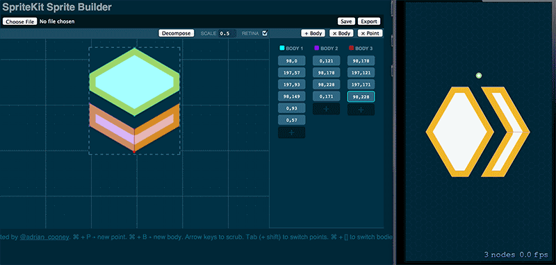
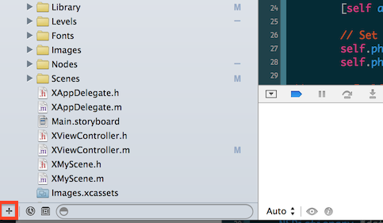

# SKImport
Design and import your complex, custom SKPhysicsBodys for SpriteKit. SKImport comes with a fancy [editor][] and a loader class for use in your apps. SKImport uses SpriteKit's `[SKPhysicsBody bodyWithPolygonFromPath]` and `[SKPhysicsBody bodyWithBodies]` to create complex, multiple sub-bodies physic bodies.

## Creating a complex physics body
##### 1. Design your body
Open up the [editor][] and import your sprite image. Design your sprite's bodies and export it.

##### 2. Add your exported sprite
Add your exported sprite JSON file to Xcode using _File > Add files to "Project Name"_ or the plus symbol at the bottom of the project navigator.

##### 3. Install SKImport
Navigate to your project's directory and install SKImport using [Cocoapods][].

	$ cd /to/your/project
	$ touch Podfile
	$ open -e Podfile

Add SKImport as a dependancy in your Podfile

	platform :ios, '7.0'
	pod 'SKImport'

And install
	
	$ pod install

##### 4. Import your sprite
Import your `SKImport` in your classes header (`.h`) file.

	#import <SKPhysicsBody+SKPhysicsBodyImport.h>

Load your sprite and set it as the `physicsBody` on your sprite.

    SKSpriteNode *sprite = [SKSpriteNode spriteNodeWithImageNamed:@"Sprite.png"];

    // Find your body file
    NSString *bodyFile = [[NSBundle mainBundle] pathForResource: @"sprite" ofType: @"json"];

    // Add your physics body
    sprite.physicsBody = [SKPhysicsBody bodyWithFile: bodyFile];

 Done! Congratulations. You're now using complex physics bodies with SpriteKit. Be sure to take a look at SpriteKit's quirks below and how to use the editor.

## Using the editor
#### Designing sprites
Designing sprites is as simple as importing your image and tracing around it. SKImport uses SpriteKit's `[SKPhysicsBody bodyWithPolygonFromPath]`. This imposes a limitation of only concave polygons (as opposed to convex polygons) as bodies. 

To circumvent this limitation, you simply need to split the body up into concave shapes. SKImport automatically combines multiple bodies into one `SKPhysicsBody` on import.

An upcoming feature of the editor is to "decompose" convex polygons into concave polygons. 

#### Shortcuts
The editor has a number of shortcuts to make path editing a little bit easier.

| Shortcut | Description          |
| ------------- | ----------- |
| &#8984; + P | Add a point to the current body. |
| &#8984; + B | Create a new body. |
| (Shift +) Tab | Navigate between points. |
| &#8984; + [] | Navigate between bodies. |
| (Shift +) &larr;, &rarr;, &darr;, &uarr; | Nudge the point. |

#### Exporting
Unfortunately, due to the cripplingly bad state of filesystem API's, SKImport editorcan't present a "Save as.." dialog without setting up a server and using a swf object. To circumvent this and enable SKImport's editor to work standalone, the editor opens a new tab with the content trusting you to CMD/Ctrl + S the contents to the appropriate position. Exported files a repositioned to the anchor point (0.5, 0.5), flipped vertically and scaled to the current scale value.

## Help
#### Installing Cocoapods
Setting up [Cocoapods][] is as simple as running:

	$ sudo gem install cocoapods
	$ pod setup

If you run into any problems, [Cocoapods][] awesome website should be enough to sort you out.

## Credits
SKImport was designed and implemented by [Adrian Cooney](http://twitter.com/adrian_cooney). Licensed under MIT.

[Cocoapods]: http://cocoapods.org
[editor]: http://adriancooney.github.io/SKImport/Editor